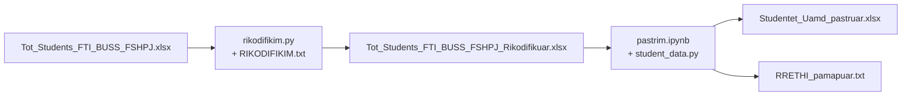

# Dokumentacion i procesit të punës — PastrimFile

Ky dokument përshkruan procesin e përgatitjes së skedarit final të studentëve UAMD, që ndodhet në folderin `FInalWork/PastrimFile`.

Qëllimi: nga skedari i bashkuar **Tot_Students_FTI_BUSS_FSHPJ.xlsx** të merret skedari i pastër **Studentet_Uamd_pastruar.xlsx**, i gatshëm për analizë.

Puna bëhet në **dy hapa të njëpasnjëshëm**:

1. **Rikodifikimi** me `rikodifikim.py` → `Tot_Students_FTI_BUSS_FSHPJ_Rikodifikuar.xlsx`
2. **Pastrimi** me `pastrim.ipynb` (logjika në `student_data.py`) → `Studentet_Uamd_pastruar.xlsx`



---

## 1. Skedarët e folderit

| Skedar | Roli |
|---|---|
| `Tot_Students_FTI_BUSS_FSHPJ.xlsx` | Hyrja: studenti i bashkuar FTI + Biznesi (FB) + FSHPJ |
| `RIKODIFIKIM.txt` | Hartat e rikodifikimit (gjinia, rrethi, shkolla, dega, viti, fakulteti, niveli) |
| `rikodifikim.py` | Hapi 1: aplikon rregullat e `RIKODIFIKIM.txt` |
| `Tot_Students_FTI_BUSS_FSHPJ_Rikodifikuar.xlsx` | Dalja e hapit 1 / hyrja e hapit 2 |
| `pastrim.ipynb` | Hapi 2: lexon skedarin e rikodifikuar, pastron, ruan skedarin final |
| `student_data.py` | Moduli me `pastro_dataframe()` që përdor notebook-u |
| `Studentet_Uamd_pastruar.xlsx` | Skedari final i pastër |
| `RRETHI_pamapuar.txt` | Vlerat e rrethit që mbeten të papastra (me presje/pikë) |

Skedari i bashkuar `Tot_Students_FTI_BUSS_FSHPJ.xlsx` vjen nga pipeline-i i mëparshëm në `KodetPythonRregTeDhenash` (bashkimi FTI / Biznesi / FSHPJ). Ky dokument fillon nga momenti kur ai skedar hyn në `PastrimFile`.

---

## 2. Hapi 1 — Rikodifikimi

**Kod:** `rikodifikim.py`  
**Rregulla:** `RIKODIFIKIM.txt`  
**Hyrje:** `Tot_Students_FTI_BUSS_FSHPJ.xlsx` (fleta `Tot_Students_FTI_BUSS_FSHPJ`)  
**Dalje:** `Tot_Students_FTI_BUSS_FSHPJ_Rikodifikuar.xlsx`

### Çfarë bën

Skripti lexon rregullat nga `RIKODIFIKIM.txt` dhe zëvendëson vlerat e kolonave me forma të njëtrajtshme. Vlerat që nuk gjenden në hartë mbeten siç janë (pas normalizimit të hapësirave). Nuk fshihet asnjë rresht.

Kolonat që rikodifikohen, në këtë radhë:

| Kolona destinacion | Kolona burim | Shembull |
|---|---|---|
| `GJINIA` | `GJINIA` | `F`, `f`, `FEMER` → `FEMER`; `M`, `B`, `MM` → `MASHKULL` |
| `RRETHI` | `RRETHI` | `DURRES`, `DURRËS, ALB`, `Katund I Ri` → `DURRËS` |
| `SHKOLLA E MESME E KRYER` | `SHKOLLA E MESME E KRYER` | variante me thonjëza/qytet → emri standard (`NAIM FRASHËRI`, `HYSEN ÇELA`, …) |
| `LLOJI I REGJISTRIMIT` | `LLOJI I REGJISTRIMIT` | `PROGRAM I I-rë`, `PIND` → `PROGRAM I PARE`; `TRANSFERIM` → `TRANSFERIM STUDIMESH` |
| `DEGA` | `DEGA` | `ADMINISTRIM BIZNES` → `ADMINISTRIM BIZNESI`; profilet e turizmit → `MENAXHIM TURIZËM` |
| `VITI` | `VITI` | `1` → `I`; `IIII` → `IV`; vite akademike (`2018-2019`) → viti romak |
| `FAKULTETI` | `Niveli_studimit` | `Biznesi Bachelor` → `FB`; `FTI Master` → `FTI`; `FSHPJ Bachelor` → `FSHPJ` |
| `Niveli_studimit` | `Niveli_studimit` | `FTI Bachelor` → `Bachelor`; `Biznesi Master` → `Master` |

`FAKULTETI` llogaritet **para** se të ndryshohet `Niveli_studimit`, sepse burimi i fakultetit është vlera e vjetër e nivelit (`FTI Bachelor`, `Biznesi Master`, …).

### Si ekzekutohet

Nga folderi `PastrimFile`:

```text
python rikodifikim.py
```

ose me rrugë të qarta:

```text
python rikodifikim.py --input Tot_Students_FTI_BUSS_FSHPJ.xlsx --output Tot_Students_FTI_BUSS_FSHPJ_Rikodifikuar.xlsx
```

Opsione të tjera: `--rules`, `--sheet`, `-v` (log i detajuar).

---

## 3. Hapi 2 — Pastrimi

**Kod:** `pastrim.ipynb` (thërret `pastro_dataframe()` nga `student_data.py`)  
**Hyrje:** `Tot_Students_FTI_BUSS_FSHPJ_Rikodifikuar.xlsx`  
**Dalje:** `Studentet_Uamd_pastruar.xlsx`

### Çfarë bën notebook-u

1. Lexon skedarin e rikodifikuar.
2. Numëron boshllëqet për çdo kolonë (para pastrimit).
3. Aplikon `pastro_dataframe()`.
4. Shtyp raportin e kontrollit (`shtyp_qa`).
5. Ruan `Studentet_Uamd_pastruar.xlsx`.

### Çfarë bën `pastro_dataframe()`

Skedari i bashkuar ka **dy skema kolonash** në të njëjtin tabelë: FTI/FSHPJ (emra në shqip) dhe Fakulteti i Biznesit (emra në anglisht). Pastrimi i bashkon në një skemë të vetme, mbyll rikodifikimin e mbetur dhe validon fushat.

Hapat kryesorë:

1. **Identifikuesi i studentit** — `ID_STUDENTI` merret nga `ID MASH`, ose në mungesë nga `MATRICULATION NO.` / `NR. MATRIKULLIT`.
2. **Bashkim skemash (shqip + anglisht)** — p.sh. `GJINIA` ∪ `GENDER`, `RRETHI` ∪ `DISTRICT`, `DATELINDJA` ∪ `DATE OF BIRTH` ∪ `DATELINDJE`, `DATA E REGJISTRIMIT` ∪ `DATE OF REGISTRATION`, `VITI` ∪ `YEAR`, `SHKOLLA` nga kolonat e shkollës së mesme, `DEGA` ∪ `PROFILI` ∪ `PROFILE`.
3. **Rikodifikim i mbetur** — gjinia (`F`/`M` → `FEMER`/`MASHKULL`), dega, rrethi dhe shkolla sipas `RIKODIFIKIM.txt` (edhe me `casefold`). Për rrethin hiqet prapashtesa `, ALB`; për shkollën hiqen thonjëzat dhe prefiksi `SHK.`.
4. **Rreth i pamapuar** — vlerat që ende kanë presje/pikë shkruhen në `RRETHI_pamapuar.txt`.
5. **Notat** — kolonat `Baze_*` dhe `Zgjedhje_*` (përfshirë `Base_*` të FB që kalojnë te `Baze_*`) validohen në intervalin **4–10**. Llogaritet `Mesatarja`, `Has_grades` dhe `Mesatarja_N_deri_AA`. Rreshtat **nuk** hiqen vetëm sepse notat janë bosh (FB përdor `Base_*`).
6. **Datat** — datëlindja, regjistrimi dhe diploma parse-ohen (`dayfirst`). Vihen flamuj: `Flag_datelindja_e_pavlefshme` (viti jashtë 1960–2010) dhe `Flag_regjistrim_i_pavlefshem` (viti jashtë 2010–2026).
7. **Niveli / fakulteti** — `FSHPJ Master` normalizohet në `Master` + `FAKULTETI = FSHPJ`.
8. **Deduplikimi** — hiqen dublikatat vetëm kur `ID_STUDENTI` është i mbushur, sipas çiftit `(ID_STUDENTI, Niveli_studimit)`. I njëjti student me Bachelor **dhe** Master ruhet si dy rreshta.
9. **Kolonat pasqyrë** — hiqen kolonat angleze/të dyfishta (`GENDER`, `DISTRICT`, `YEAR`, `DATE OF BIRTH`, `PROFILI`, `NR. MATRIKULLIT`, …).

### Si ekzekutohet

Hapni `pastrim.ipynb` në Cursor / Jupyter, zgjidhni kernel-in e `.venv` të `FInalWork`, pastaj **Run All**.

---

## 4. Rezultatet e ekzekutimit

Numrat më poshtë vijnë nga ekzekutimi i fundit i `pastrim.ipynb` në këtë folder.

| Tregues | Para pastrimit | Pas pastrimit |
|---|---|---|
| Rreshta | 14 943 | 14 871 |
| Kolona | 60 | 48 |
| Deduplikim (ID + nivel, pa ID bosh) | 14 943 | 14 871 |
| Me nota të vlefshme (4–10) | — | 12 970 (`Has_grades`) |
| Pa nota | — | 1 905 para deduplikimit |
| Dublikata të mbetura (ID + nivel, me ID) | — | 0 |
| Nota jashtë 4–10 | — | 0 |
| Flag datëlindje e pavlefshme | — | 36 |
| Flag regjistrim i pavlefshëm | — | 105 |
| RRETHI unikë | — | 1 376 |
| Ende me presje/pikë (në `RRETHI_pamapuar.txt`) | — | 475 |

### Shpërndarje pas pastrimit

**ID e mbushur sipas fakultetit**

| Fakulteti | Me ID | Pa ID |
|---|---|---|
| FB | 8 812 | 1 |
| FSHPJ | 2 855 | 22 |
| FTI | 2 593 | 588 |

**Fakulteti × niveli**

| Fakulteti | Bachelor | Master |
|---|---|---|
| FB | 3 330 | 5 483 |
| FSHPJ | 2 451 | 426 |
| FTI | 2 664 | 517 |

**Gjinia:** FEMER 8 484 · MASHKULL 6 376 · bosh 11

**Viti:** I 3 935 · II 2 443 · III 3 628 · IV 1 447 · V 336 · VI 355 · VII 133 · bosh 2 594

---

## 5. Si të riprodhohet e gjithë zinxhiri

Nga `C:\Users\esoft\Desktop\Projekt-ModeliStudenteve\FInalWork\PastrimFile`:

```text
python rikodifikim.py
```

Pastaj hapni `pastrim.ipynb` dhe ekzekutoni të gjitha qelizat.

Kontrolloni që ekzistojnë:

- `Tot_Students_FTI_BUSS_FSHPJ_Rikodifikuar.xlsx`
- `Studentet_Uamd_pastruar.xlsx`
- `RRETHI_pamapuar.txt`

Varësitë Python: `pandas`, `openpyxl`. Mjedisi virtual i projektit është `FInalWork/.venv`.

---

## 6. Shënime

- Nuk ka skedar `pastrim.py` në këtë folder. Hapi 2 është `pastrim.ipynb`; funksioni i pastrimit është `pastro_dataframe()` në `student_data.py`.
- `RRETHI_pamapuar.txt` nuk është gabim i procesit: është lista e vlerave që s’u standardizuan plotësisht (fshatra, kombinime qytet-rreth, vende jashtë vendit). Mund të përdoret për një raund të dytë rikodifikimi.
- Skedari final `Studentet_Uamd_pastruar.xlsx` është hyrja e analizës përshkruese në folderin `DescriptiveAnalyse`.
