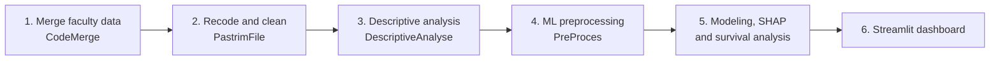

<div align="center">

# 🎓 Modeli i Studentit Optimal në UAMD

### Predictive analytics for student success at the University of Durrës

[](https://www.python.org/)
[](https://scikit-learn.org/)
[](https://streamlit.io/)
[](#license)
[](#data-privacy)

**[English](#english) · [Shqip](#shqip)**

</div>

---

<a id="english"></a>

## 🇬🇧 English

### Overview

This project is a predictive analytics pipeline for estimating students' final average grade and identifying early risk of delayed graduation or dropout at the University of Durrës (UAMD).

The models use demographic information and **first-year grades only**. Grades from later years are deliberately excluded to prevent target leakage and support genuinely early intervention. The study covers the FB, FTI, and FSHPJ faculties at Bachelor and Master level.

> **Privacy:** The repository contains analysis and modeling code only. Student records and source databases remain on the local machine and are not distributed.

### 🎯 Objectives

- **Regression:** predict `MES_PERGJ`, the final average grade.
- **Classification:** predict `RREZIK_VONESE`, the early risk of delayed graduation or dropout.
- **Survival analysis:** study time to graduation with Kaplan–Meier and Cox proportional-hazards models.
- **Explainability:** inspect model behavior with SHAP.
- **Dashboard:** explore predictions through the Streamlit app at [`FInalWork/PreProces/ML/app.py`](FInalWork/PreProces/ML/app.py).

### 🔄 Pipeline



1. Merge faculty databases with the scripts in [`FInalWork/KodetPythonRregTeDhenash/CodeMerge`](FInalWork/KodetPythonRregTeDhenash/CodeMerge).
2. Recode and clean the merged data with [`rikodifikim.py`](FInalWork/PastrimFile/rikodifikim.py) and [`pastrim.ipynb`](FInalWork/PastrimFile/pastrim.ipynb).
3. Run descriptive analysis with [`eda_studenti_optimal_uamd.py`](FInalWork/DescriptiveAnalyse/eda_studenti_optimal_uamd.py).
4. Create leakage-safe regression and classification datasets with [`preprocess_ml_dual.py`](FInalWork/PreProces/preprocess_ml_dual.py).
5. Train models, generate SHAP explanations, and run survival analysis with [`faza_d_modeling_survival.py`](FInalWork/PreProces/ML/faza_d_modeling_survival.py).
6. Launch the interactive Early Warning System dashboard.

### 🗂️ Repository structure

| Directory | Purpose |
| --- | --- |
| [`FInalWork/KodetPythonRregTeDhenash`](FInalWork/KodetPythonRregTeDhenash) | Build and merge faculty databases |
| [`FInalWork/PastrimFile`](FInalWork/PastrimFile) | Recode and clean the merged dataset |
| [`FInalWork/DescriptiveAnalyse`](FInalWork/DescriptiveAnalyse) | Univariate and bivariate analysis |
| [`FInalWork/PreProces`](FInalWork/PreProces) | Leakage-safe preprocessing for ML |
| [`FInalWork/PreProces/ML`](FInalWork/PreProces/ML) | Models, SHAP, survival analysis, and dashboard |
| [`FInalWork/Permbledhje`](FInalWork/Permbledhje) | Local project reports |
| [`FInalWork/docs`](FInalWork/docs) | Design and implementation notes |

### 🚀 Installation and execution

Run the following commands from `FInalWork`:

```powershell
cd FInalWork
python -m venv .venv
.\.venv\Scripts\Activate.ps1

pip install -r ..\requirements.txt
pip install -r DescriptiveAnalyse\requirements_eda_optimal.txt

python PastrimFile/rikodifikim.py
# Open PastrimFile/pastrim.ipynb and run all cells
python DescriptiveAnalyse/eda_studenti_optimal_uamd.py --no-show
python PreProces/preprocess_ml_dual.py
python PreProces/ML/faza_d_modeling_survival.py
python -m streamlit run PreProces/ML/app.py
```

### 🤖 Models and predictors

The train/test split is 80/20 with `random_state=42`.

Predictors include `MOSHA`, `GJINIA`, `RRETHI`, `GJIMNAZI`, `PROFIL_GJIMNAZ`, `LLOJ_RREGJ`, `DEGA`, `FAKULTETI`, and first-year results such as `Baze_11`, `Zgjedhje_11`, `Baze_12`, `Zgjedhje_12`, and `MES_VIT1`.

| Task | Models | Metrics |
| --- | --- | --- |
| Regression (`MES_PERGJ`) | Ridge, Lasso, Decision Tree, Random Forest, SVR | RMSE, MAE, R² |
| Classification (`RREZIK_VONESE`) | Logistic Regression, Decision Tree, Random Forest, SVC | Accuracy, precision, recall, F1, AUC |
| Survival | Kaplan–Meier, Cox PH | Time-to-graduation analysis |

### 📊 Outputs

Phase D produces the academic report, model artifacts, evaluation figures, ROC and confusion-matrix plots, Kaplan–Meier and hazard-ratio plots, SHAP visualizations, and the Early Warning System bundle. See [`FInalWork/PreProces/ML/README.md`](FInalWork/PreProces/ML/README.md) for details.

<a id="data-privacy"></a>

### 🔒 Data and privacy

Raw Excel (`.xlsx`, `.xls`), CSV, SPSS (`.sav`), and faculty databases are **not included**. Place them locally in the paths expected by the scripts.

Original databases belong in `FInalWork/KodetPythonRregTeDhenash/DB_original/`. The merge step produces files in `FInalWork/KodetPythonRregTeDhenash/ResultFiles/`, including `Tot_Students_FTI_BUSS_FSHPJ.xlsx`. Downstream steps expect the cleaned Excel file, `Studentet_Uamd_pastruar_spss.xlsx`, and the two generated CSV datasets:

- `dataset_ml_regression.csv`
- `dataset_ml_classification.csv`

### 📚 Documentation

- [Cleaning process](FInalWork/PastrimFile/DOKUMENTIM_Procesi_Pastrimit.md)
- [Dual ML preprocessing design](FInalWork/docs/superpowers/specs/2026-09-17-preprocess-dual-ml-design.md)
- [Phase D modeling and survival design](FInalWork/docs/superpowers/specs/2026-09-17-faza-d-ml-survival-design.md)
- [Phase D and dashboard README](FInalWork/PreProces/ML/README.md)

### 👤 Author

- **Name:** [insert name]
- **Program:** [insert program]
- **Year:** [insert year]

---

<a id="shqip"></a>

## 🇦🇱 Shqip

### Përmbledhje

Ky projekt është një pipeline analitike parashikuese për parashikimin e mesatares përfundimtare dhe identifikimin e rrezikut të hershëm për vonesë në diplomim ose braktisje të studimeve në Universitetin e Durrësit (UAMD).

Modelet përdorin vetëm të dhënat demografike dhe **notat e vitit të parë**. Notat e viteve të mëvonshme përjashtohen qëllimisht për të parandaluar rrjedhjen e informacionit dhe për të mundësuar ndërhyrje sa më të hershme. Studimi mbulon fakultetet FB, FTI dhe FSHPJ, në nivel Bachelor dhe Master.

> **Privatësia:** Repositorit përmban vetëm kodin e analizës dhe modelimit. Të dhënat e studentëve dhe databazat burimore qëndrojnë lokalisht dhe nuk shpërndahen.

### 🎯 Objektivat

- **Regresion:** parashikimi i `MES_PERGJ`, mesatares përfundimtare.
- **Klasifikim:** parashikimi i `RREZIK_VONESE`, rrezikut të hershëm për vonesë ose braktisje.
- **Analizë survival:** studimi i kohës deri në diplomim me Kaplan–Meier dhe Cox.
- **Shpjegueshmëri:** interpretimi i modeleve me SHAP.
- **Dashboard:** aplikacioni Streamlit në [`FInalWork/PreProces/ML/app.py`](FInalWork/PreProces/ML/app.py).

### 🔄 Rrjedha e pipeline-it

1. Bashkimi i databazave të fakulteteve me skriptet e `CodeMerge`.
2. Rikodifikimi dhe pastrimi me `rikodifikim.py` dhe `pastrim.ipynb`.
3. Analiza përshkruese me `eda_studenti_optimal_uamd.py`.
4. Krijimi i dataset-eve pa rrjedhje informacioni me `preprocess_ml_dual.py`.
5. Trajnimi i modeleve, shpjegimet SHAP dhe analiza survival me `faza_d_modeling_survival.py`.
6. Hapja e dashboard-it interaktiv të paralajmërimit të hershëm.

### 🗂️ Struktura e repositorit

| Dosja | Përmbajtja |
| --- | --- |
| `FInalWork/KodetPythonRregTeDhenash` | Ndërtimi dhe bashkimi i databazave |
| `FInalWork/PastrimFile` | Rikodifikimi dhe pastrimi |
| `FInalWork/DescriptiveAnalyse` | Analiza univariate dhe bivariate |
| `FInalWork/PreProces` | Përgatitja e të dhënave për ML |
| `FInalWork/PreProces/ML` | Modelet, SHAP, survival dhe dashboard-i |
| `FInalWork/Permbledhje` | Raportet lokale të projektit |
| `FInalWork/docs` | Dokumentacioni i dizajnit dhe zbatimit |

### 🚀 Instalimi dhe ekzekutimi

Komandat ekzekutohen nga dosja `FInalWork`:

```powershell
cd FInalWork
python -m venv .venv
.\.venv\Scripts\Activate.ps1

pip install -r ..\requirements.txt
pip install -r DescriptiveAnalyse\requirements_eda_optimal.txt

python PastrimFile/rikodifikim.py
# Hapni PastrimFile/pastrim.ipynb dhe ekzekutoni të gjitha qelizat
python DescriptiveAnalyse/eda_studenti_optimal_uamd.py --no-show
python PreProces/preprocess_ml_dual.py
python PreProces/ML/faza_d_modeling_survival.py
python -m streamlit run PreProces/ML/app.py
```

### 🤖 Modelet dhe parashikuesit

Ndarja trajnim/test është 80/20 me `random_state=42`. Parashikuesit përfshijnë `MOSHA`, `GJINIA`, `RRETHI`, `GJIMNAZI`, `PROFIL_GJIMNAZ`, `LLOJ_RREGJ`, `DEGA`, `FAKULTETI` dhe rezultatet e vitit të parë: `Baze_11`, `Zgjedhje_11`, `Baze_12`, `Zgjedhje_12` dhe `MES_VIT1`.

| Detyra | Modelet | Metrikat |
| --- | --- | --- |
| Regresion (`MES_PERGJ`) | Ridge, Lasso, Decision Tree, Random Forest, SVR | RMSE, MAE, R² |
| Klasifikim (`RREZIK_VONESE`) | Logistic Regression, Decision Tree, Random Forest, SVC | Accuracy, precision, recall, F1, AUC |
| Survival | Kaplan–Meier, Cox PH | Analiza e kohës deri në diplomim |

### 🔒 Të dhënat dhe privatësia

Skedarët Excel, CSV, SPSS dhe databazat e fakulteteve **nuk përfshihen** në repositor. Vendosini lokalisht në rrugët që presin skriptet. Procesi i bashkimit prodhon `Tot_Students_FTI_BUSS_FSHPJ.xlsx`, ndërsa hapat pasues prodhojnë dataset-et `dataset_ml_regression.csv` dhe `dataset_ml_classification.csv`.

### 📚 Dokumentacioni

- [Procesi i pastrimit](FInalWork/PastrimFile/DOKUMENTIM_Procesi_Pastrimit.md)
- [Dizajni i preprocessing dual ML](FInalWork/docs/superpowers/specs/2026-09-17-preprocess-dual-ml-design.md)
- [Dizajni i fazës D](FInalWork/docs/superpowers/specs/2026-09-17-faza-d-ml-survival-design.md)
- [README i fazës D dhe dashboard-it](FInalWork/PreProces/ML/README.md)


## 📄 License / Licenca

This code is intended for academic use. Student data is not licensed for redistribution.

Kodi është për përdorim akademik. Të dhënat e studentëve nuk licencohen për rishpërndarje.
